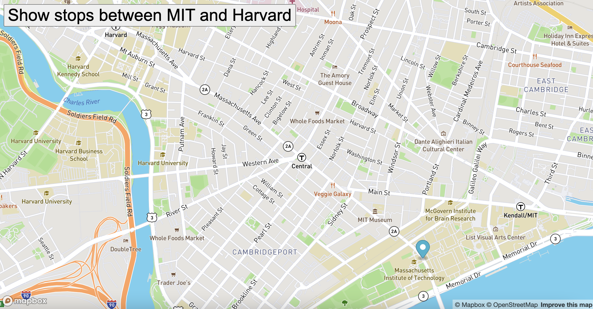

# Real-Time-Bus-Tracker Project

## Description
This exercise used mapbox to display a map and bus tracker on the page. Using MBTA bus data, I located the bus stops between Harvard and MIT. An animated marker on the map highlights the bus route following those stops.

## Screenshot

## How to Run
You can open the game at the following link: 
To run the game on your machine, download the files via the green Code button in the GitHub repository and open on your local browser.

## Future Improvements
Next, I want to work on updating the map so that specific stops are marked. I would also like to add more routes.

## License
MIT License

Copyright (c) 2021 Taylor Tremaine

Permission is hereby granted, free of charge, to any person obtaining a copy
of this software and associated documentation files (the "Software"), to deal
in the Software without restriction, including without limitation the rights
to use, copy, modify, merge, publish, distribute, sublicense, and/or sell
copies of the Software, and to permit persons to whom the Software is
furnished to do so, subject to the following conditions:

The above copyright notice and this permission notice shall be included in all
copies or substantial portions of the Software.

THE SOFTWARE IS PROVIDED "AS IS", WITHOUT WARRANTY OF ANY KIND, EXPRESS OR
IMPLIED, INCLUDING BUT NOT LIMITED TO THE WARRANTIES OF MERCHANTABILITY,
FITNESS FOR A PARTICULAR PURPOSE AND NONINFRINGEMENT. IN NO EVENT SHALL THE
AUTHORS OR COPYRIGHT HOLDERS BE LIABLE FOR ANY CLAIM, DAMAGES OR OTHER
LIABILITY, WHETHER IN AN ACTION OF CONTRACT, TORT OR OTHERWISE, ARISING FROM,
OUT OF OR IN CONNECTION WITH THE SOFTWARE OR THE USE OR OTHER DEALINGS IN THE
SOFTWARE.
